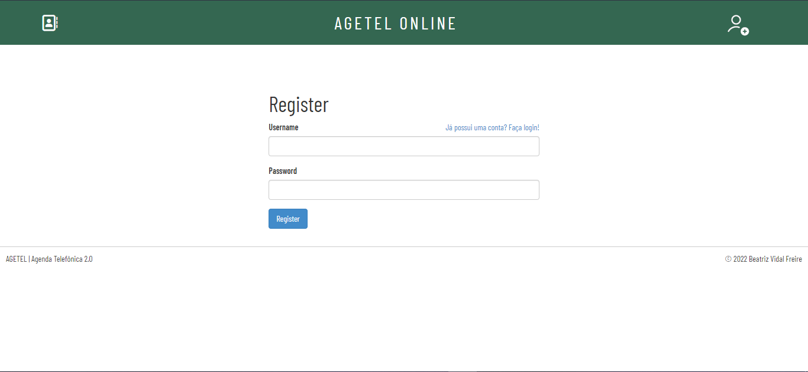
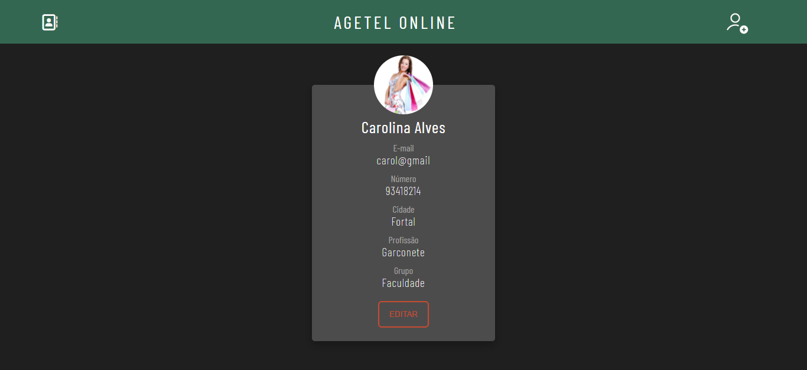
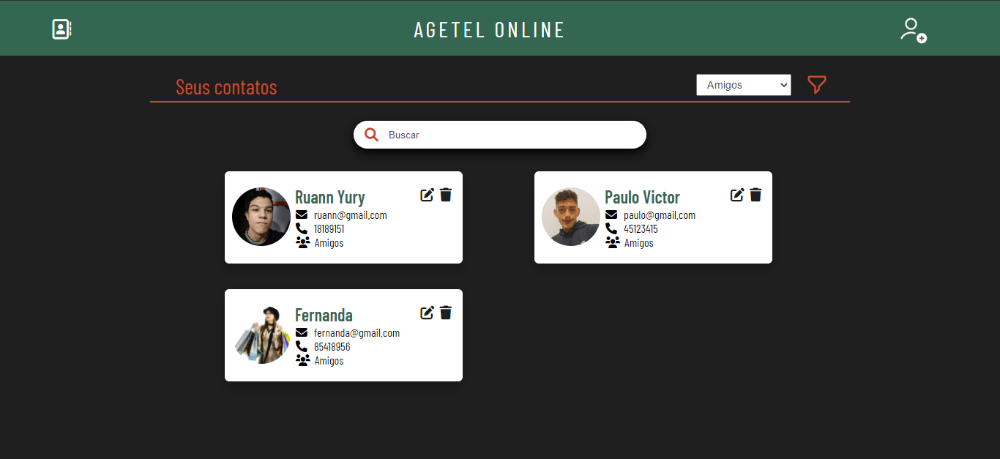

# Projeto Final de Engenharia de Software
###  Agenda Virtual de Contatos
####  Equipe: Beatriz Vidal Freire, Evellyn Gisely de Castro, Nilton Luan Guedes Barros e Paulo Victor Souza Rodrigues

> [Clique aqui para ver o video de demonstração do sistema!](https://www.linkedin.com/posts/beatriz-vidal-a2b114200_python-html-css-activity-6915416401314791424-HxG1?utm_source=linkedin_share&utm_medium=member_desktop_web)

## Sumário

* [Documentação](#Documentação)
* [Telas do Sistema](#Telas-do-Sistema)
* [UML](#UML)
* [Autores](#Autores)

##### Documentação
######  Projeto
> Nome: Agenda Telefonica Virtual
Versão: 2.0
[Link do Código](https://github.com/biavidalf/biavidalf.github.io)

###### Editores UML usados
> LucidChart e GenMyModel

###### Linguagem
> Python, HTML, CSS e JS

###### Framework
> Flask

###### Database
> SQLite e SQLAlquemy

###### Referencias
>[Flask documentation (Flask-user)](https://flask-user.readthedocs.io/en/latest/quickstart.html)
[Github Flask User](https://github.com/lingthio/Flask-User)
[W3schools](https://www.w3schools.com/css/default.asp)
[Youtube Flask User App Tea Time](https://www.youtube.com/watch?v=baxLKI4-QKE&t=501s)
[SQLAlchemy documentation](https://flask-sqlalchemy.palletsprojects.com/)
[Jinja documentation](https://jinja.palletsprojects.com/en/2.10.x/templates/)
[Flask WTForms documentation](https://flask-wtf.readthedocs.io/)
[Stack OverFlow](https://stackoverflow.com/)
[Video sobre diagrama de implementação](https://www.youtube.com/watch?v=P0wXFFsdMzI)
[Video sobre diagrama de componentes](https://www.youtube.com/watch?v=2VUPhYY_YLE&t=605s)
[Video uml diagrams sequence](https://www.youtube.com/watch?v=pCK6prSq8aw)
[Video sobre diagrama de sequencia](https://www.youtube.com/watch?v=UVkj3ed0ZuM&t=374s)
[Video sobre arquitetura mvc](https://www.youtube.com/watch?v=ZW2JLtX4Dag)
[Video padrão mvc](https://www.youtube.com/watch?v=mMDt9g7bMjk)
[Video sobre diagrama de atividade](https://www.youtube.com/watch?v=vReuK7_tYWc&list=PLvSnBLKgRyHWINbSrLEEE6cen3ghoM_LG&index=8)
[Video sobre diagrama de caso de uso](https://www.youtube.com/watch?v=xrcgbMQdM8Y&list=PLvSnBLKgRyHWINbSrLEEE6cen3ghoM_LG&index=7)
[Tutoral diagrama de pacotes](https://www.lucidchart.com/pages/pt/diagrama-de-pacotes-uml/#section_2)
[Tutorial diagrama de estados](https://www.lucidchart.com/pages/uml-state-machine-diagram)

##### Telas do Sistema

###### Tela Login

######  Tela Registro

###### Tela Inicial (contatos)

###### Tela Edição de Contato

###### Tela Individual do Contato

###### Tela Adição de Contato

###### Tela Mecanismo de Busca

###### Tela Filtro de Grupos

###### Tela Filtro de Grupos

##### UML
###### a. Desenvolver os casos de uso do sistema.

**_Caso de Uso - Agenda de Telefone_**

###### Caso de Uso: Criar perfil
>Ator: Usuário
1. O usuário acessa o site
2. Cadastro seus dados
3. Se os dados cumprirem os requisitos, cadastro concluído
4. Se os dados não cumprirem os requisitos, cadastro cancelado/não concluído.

######  Caso de Uso: Adicionar contato
>Ator: Usuário
1. O usuário acessa o site
2. Realiza o login
3. Se os dados ok, segue. Se não, permanece até os dados corretos serem adicionados.
4. Insere contato - Se os dados cumprirem os requisitos, cadastro concluído. Se os dados não cumprirem os requisitos, cadastro cancelado/não concluído.

###### Caso de Uso: Remover contato
>Ator: Usuário
1. O usuário acessa o site
2. Realiza o login
3. Se os dados ok, segue. Se não, permanece até os dados corretos serem adicionados.
4. Apagar contato

###### Caso de Uso: Buscar contato
>Ator: Usuário
1. O usuário acessa o site
2. Realiza o login
3. Se os dados ok, segue. Se não, permanece até os dados corretos serem adicionados.
4. Clica em buscar contatos
5. Se o contato existir, exibir dados do contato.
6. Se o contato não existir, encaminhar para opção de Inserir Contato.

###### b. Elaborar diagramas de sequência para os casos de uso mais importantes.

- [x] Busca e Delete de um contato
- [x] Adição de um novo contato
- [x] Registro de Usuário

###### Diagrama de Sequência -  Busca e Delete de um Contato

###### Diagrama de Sequência - Adicionar Novo Contato

###### Diagrama de Sequência - Registro de Usuário

###### c. Elaborar diagramas de atividade. Elabore, no mínimo, os seguintes diagramas de atividades:
- [x] Listagem de um dado contato
- [x] Mapa de navegação de telas

###### Diagrama de Atividade - Mapa de Navegação de Telas

###### d. Elaborar os diagramas de classe do sistema.

> A seguir se encontra o digrama se classes do nosso sistema, foi a partir dele, e dos outros diagramas, que desenvolvemos o nosso projeto. A classe Usuário e a classe Contato se associam mutualmente, já as classes Grupo e Contato têm uma associação unilateral, pois somente a classe Grupo se associa a classe Contato.

###### e. Elaborar os diagramas de estado de um objeto Conta (Account)

###### f. Explicitar a arquitetura escolhida. Use, para tal, diagramas de componentes e/ou de pacotes.

>A arquitetura escolhida foi a MVC, que é muito vista em aplicações para Web, onde a View é geralmente a página HTML, e o código que gera os dados dinâmicos para dentro do HTML é o Controller. E, por fim, o Model é representado pelo conteúdo de fato, geralmente armazenado em bancos de dados ou arquivos XML.
Ainda que existam diferentes formas de MVC, o controle de fluxo geralmente funciona como segue:
1. O usuário interage com a interface de alguma forma (por exemplo, o usuário aperta um botão)
2. O Controller manipula o evento da interface do usuário através de uma rotina pré-escrita.
3. O Controller acessa o Model, possivelmente atualizando-o de uma maneira apropriada, baseado na interação do usuário (por exemplo, atualizando os dados de cadastro do usuário).
4. Algumas implementações de View utilizam o Model para gerar uma interface apropriada (por exemplo, mostrando na tela os dados que foram alterados juntamente com uma confirmação). O View obtém seus próprios dados do Model. O Model não toma conhecimento direto da View.
5. A interface do usuário espera por próximas interações, que iniciarão o ciclo novamente.

###### g. Elaborar os diagramas de implantação.

##### Autores
* Autores do READ.ME + UML: Beatriz Vidal Freire, Evellyn Gisely de Castro, Nilton Luan Guedes Barros e Paulo Victor Souza Rodrigues
> Autor do sistema e do design (Python/Flask, HTML e CSS): Beatriz Vidal Freire
>  Entre em contanto:
> [Linkedin](https://www.linkedin.com/in/beatriz-vidal-a2b114200/) |
> [Instagram](https://www.instagram.com/bvidalf/)